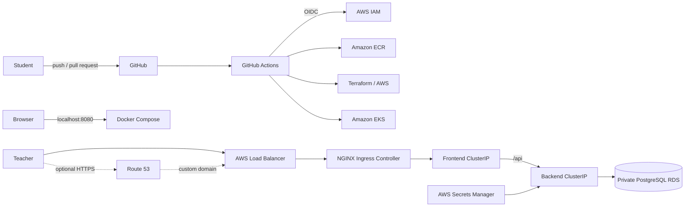

# BookingKG — Final DevOps Capstone

**Language:** [Русский](ASSIGNMENT.md) · English

## 1. Project scenario

The development team provides a working **BookingKG** application:

- `frontend/` — React application;
- `backend/` — Node.js/Express REST API;
- `database/init.sql` — initial PostgreSQL schema.

The application supports registration, authentication, destination search,
favorites, availability checks, bookings, cancellation, and vouchers. Your
role is **DevOps engineer**. Do not rewrite the application business logic.
Package it into containers, create the cloud infrastructure, deploy it to
Kubernetes, and build a secure CI/CD process.

Three access modes are considered:

1. **Localhost — required:** Docker Compose exposes the full stack at
   `http://localhost:8080`.
2. **AWS Load Balancer URL — required:** the EKS application is accessible by
   the external hostname created for the ingress controller.
3. **Custom domain and HTTPS — optional:** required only when the course
   supplies a student subdomain and Route 53 access. Students never need to buy
   a domain with personal funds.

The complete system must be reproducible from the Git repository and its
documentation.

## 2. Target architecture



An equivalent GCP track (`GKE + Artifact Registry + Cloud SQL + Cloud DNS`) is
allowed only with teacher approval.

## 3. What the student receives

Provided: frontend and backend source code, SQL schema, application/API
description, this assignment, and an approved AWS sandbox.

Not provided: Dockerfiles, Docker Compose, Terraform implementation,
Kubernetes manifests, CI/CD workflows, cloud credentials, a deployed database,
DNS records, or TLS certificates.

## 4. General rules

> Helm is optional. Plain Kubernetes YAML is acceptable when every resource is
> reproducible, versioned, and meets the acceptance criteria.

1. Main AWS resources must be created through Terraform.
2. Never commit AWS keys, passwords, kubeconfig, state, `.env`, or private keys.
3. Store application images in private ECR repositories.
4. Use GitHub OIDC instead of permanent AWS access keys.
5. RDS must remain private.
6. Backend must not have a direct public endpoint.
7. Use meaningful Git commits.
8. Resources must be removable through `terraform destroy`.
9. The student is responsible for stopping paid resources after review.

---

# Tasks

## Task 1. Study the application and prepare a plan

Determine frontend/backend ports, API prefix, PostgreSQL variables, health
endpoint, and database tables. Draw local and cloud request flows, create an
implementation plan, and estimate AWS cost.

**Deliverables:** architecture section, diagrams, port/protocol/dependency
table, and a list of paid services.

**Acceptance:** explain the complete browser-to-PostgreSQL path and identify
which components are public and private. Frontend must never connect directly
to PostgreSQL.

## Task 2. Containerize frontend and backend

- create separate frontend and backend Dockerfiles;
- use a Node.js build stage and Nginx runtime stage for frontend;
- support SPA fallback and proxy `/api/*` to backend;
- run backend as a non-root user;
- add `.dockerignore` files;
- exclude `.env`, `.git`, `node_modules`, and build cache;
- pin suitable base-image versions.

```bash
docker build -t bookingkg-frontend:test frontend
docker build -t bookingkg-backend:test backend
docker image ls
```

Both images must build. Frontend returns HTML, backend starts with environment
variables, and runtime containers do not contain unnecessary build content.

## Task 3. Create the local full stack

Create `docker-compose.yml` with PostgreSQL, backend, and frontend. Include a
named database volume, schema initialization, health checks, health-based
dependencies, local-only credentials, restart policy, and publish only the
frontend port.

```bash
docker compose up --build -d
docker compose ps
curl http://localhost:8080/api/health
```

Registration, login, catalog, favorites, and booking must work. Data must
survive `docker compose restart`; `docker compose down --volumes` must allow a
clean database on the next start.

## Task 4. Configure Terraform remote state

Create a dedicated S3 state bucket with encryption, versioning, public-access
block, and state locking. Configure the S3 backend, keep state out of Git, and
commit `.terraform.lock.hcl`.

```bash
terraform init
terraform fmt -check -recursive
terraform validate
terraform plan
```

State must be remote and concurrent operations must be protected by locking.

## Task 5. Create the AWS network with Terraform

Create a VPC across at least two Availability Zones with public subnets for the
load balancer/NAT, private subnets for EKS nodes, isolated database subnets,
Internet Gateway, NAT Gateway, route tables, Kubernetes subnet tags, and common
`Project`, `Environment`, and `ManagedBy` tags.

CIDRs must not overlap. RDS subnets must have no public route, worker nodes must
not require direct inbound internet traffic, and the diagram must match plan.

## Task 6. Create ECR repositories

Create private `bookingkg-frontend` and `bookingkg-backend` repositories through
Terraform. Enable scan-on-push and lifecycle policies. Deploy immutable Git SHA
tags; do not rely on `latest`.

```bash
aws ecr describe-repositories
aws ecr list-images --repository-name bookingkg-frontend
aws ecr list-images --repository-name bookingkg-backend
```

## Task 7. Create private PostgreSQL RDS

Create encrypted PostgreSQL RDS in isolated subnets with
`publicly_accessible = false`, at least one day of dev backup retention, storage
autoscaling, and port 5432 allowed only from the EKS workload/node security
group. Generate credentials securely and store them in Secrets Manager.

Passwords in Terraform variables, workflows, or manifests and PostgreSQL
ingress from `0.0.0.0/0` are prohibited.

Initialize the schema through a Kubernetes Job, migration container, or CI/CD
migration step. Manual SQL from a laptop cannot be the only deployment method.

## Task 8. Create the EKS cluster

Use Terraform to create the control plane, private managed node group, at least
two desired nodes, scaling configuration, access entries, IAM roles, CoreDNS,
kube-proxy, and VPC CNI.

```bash
aws eks update-kubeconfig --name CLUSTER_NAME --region AWS_REGION
kubectl get nodes
kubectl get pods -A
```

Nodes and system Pods must be Ready. GitHub Actions must use a separate,
controlled access path rather than a shared administrator identity.

## Task 9. Manage database secrets

Backend requires `PGHOST`, `PGPORT`, `PGDATABASE`, `PGUSER`, and `PGPASSWORD`.
AWS Secrets Manager is the source of truth. Deliver secrets through External
Secrets Operator, Secrets Store CSI Driver, or controlled CI/CD synchronization
to a Kubernetes Secret. Document the selected method and trade-offs.

Secret values must not appear in Git or Actions logs and must be replaceable
without rebuilding the image.

## Task 10. Write Kubernetes manifests

Create namespace `bookingkg`, frontend/backend Deployments, and ClusterIP
Services. Each Deployment requires two replicas, labels/selectors, Git SHA image
tag, ports, requests/limits, readiness/liveness probes, rolling update strategy,
configuration/secrets, and a non-root security context where supported.

Backend must not use `LoadBalancer` or `NodePort`.

```bash
kubectl -n bookingkg get deployments,pods,services
kubectl -n bookingkg rollout status deployment/frontend
kubectl -n bookingkg rollout status deployment/backend
```

All replicas must be Ready, Services must have endpoints, and a deleted Pod
must be recreated automatically.

## Task 11. Install NGINX Ingress Controller

Install a pinned ingress-nginx controller version using manifests or Helm.
Create an Ingress for `/` and `/api`, explain the selected request path, and
ensure only the ingress controller creates a public LoadBalancer.

```bash
kubectl get ingress -A
kubectl get service -n ingress-nginx
helm list -A  # when Helm is used
```

The AWS hostname must open frontend without port-forwarding and
`/api/health` must return HTTP 200. Backend remains private.

## Task 12. Configure Route 53 and ExternalDNS

This task is required only when the teacher provides a subdomain and Route 53
access; otherwise it is a bonus task. Use the assigned subdomain, restrict
ExternalDNS to the approved hosted zone, use IRSA/Pod Identity, and add the
required annotations.

```bash
kubectl logs -n external-dns deployment/external-dns
dig YOUR_DOMAIN
curl -I http://YOUR_DOMAIN
```

DNS must track the load balancer automatically without permission to modify
unrelated hosted zones.

## Task 13. Configure TLS with cert-manager

Required only when a training subdomain is supplied; otherwise bonus. Install a
pinned cert-manager version, validate a Let's Encrypt staging issuer first,
then configure production issuance, Ingress TLS, and HTTPS redirect.

```bash
kubectl get certificate,certificaterequest,challenge -A
curl -I https://YOUR_DOMAIN
openssl s_client -connect YOUR_DOMAIN:443 -servername YOUR_DOMAIN
```

The certificate must be Ready, trusted by the browser, automatically renewable,
and its private key must never be stored in Git.

## Task 14. Configure GitHub Actions with AWS OIDC

Infrastructure workflow:

```text
checkout → OIDC → fmt → init → validate → security scan → plan
         → apply with manual approval
```

Plan runs on pull requests. Apply is limited to `main` and a protected
environment, uses concurrency control, and stores no AWS keys.

Application workflow:

```text
checkout → tests → build → vulnerability scan → ECR push with Git SHA
         → migration → deploy → rollout verification → smoke test
```

A failed build must not change the running deployment. Smoke tests verify the
external application and `/api/health`; custom-domain implementations also test
HTTPS.

## Task 15. Add security and reliability controls

Required controls: least-privilege IAM where practical, protected apply
environment, ECR scanning, encrypted/private RDS, resource limits, probes,
non-root containers where supported, sanitized logs, ignored Terraform
sensitive files, backup/restore plan, and rollback procedure.

```bash
kubectl -n bookingkg rollout history deployment/frontend
kubectl -n bookingkg rollout undo deployment/frontend
```

Explain Pod and node failure behavior, backup location, password rotation, and
GitHub Actions access boundaries.

## Task 16. Documentation and final defense

README must cover architecture, technology, prerequisites, localhost, AWS
bootstrap, GitHub variables, deployment, Load Balancer access, optional
DNS/TLS, troubleshooting, rollback, cleanup, screenshots, and limitations.

During the defense, demonstrate commit history, successful workflows, state and
plan, ECR Git SHA images, Kubernetes resources, local and cloud applications,
registration/login, search and booking, favorites/cancellation, RDS connection,
Pod recovery, rollout/rollback, and absence of secrets in Git.

---

# Final deliverables

```text
.
├── .github/workflows/{terraform.yml,deploy.yml}
├── backend/{Dockerfile,.dockerignore}
├── frontend/{Dockerfile,.dockerignore,nginx.conf}
├── database/
├── kubernetes/{namespace.yml,backend.yml,frontend.yml,ingress.yml,database-migration.yml}
├── terraform/{backend.tf,versions.tf,variables.tf,networking.tf,eks.tf,ecr.tf,rds.tf,iam.tf,dns.tf,outputs.tf}
├── helm-values/                  # optional when Helm is used
├── docker-compose.yml
└── README.md
```

# Evidence checklist

- [ ] localhost screenshot;
- [ ] AWS Load Balancer URL;
- [ ] optional HTTPS custom domain;
- [ ] successful infrastructure and deployment workflow links;
- [ ] Terraform plan summary;
- [ ] ECR repositories/images;
- [ ] EKS nodes, Pods, Services, and Ingress;
- [ ] optional Route 53 and certificate evidence;
- [ ] BookingKG catalog and booked trip;
- [ ] `/api/health` result;
- [ ] cost report;
- [ ] cleanup confirmation.

# Grading — 100 points

| Category | Points |
| --- | ---: |
| Dockerfiles and Docker Compose | 10 |
| Terraform quality and remote state | 10 |
| VPC/networking | 10 |
| ECR and image lifecycle | 5 |
| Private RDS and initialization | 10 |
| EKS and Kubernetes workloads | 15 |
| Ingress, Route 53, and ExternalDNS | 10 |
| cert-manager and HTTPS | 8 |
| GitHub Actions and OIDC | 12 |
| Security and reliability | 5 |
| README, evidence, and defense | 5 |
| **Total** | **100** |

When the course does not provide a domain, the 18 DNS/TLS points are moved to
networking (+4), EKS/Kubernetes (+4), GitHub Actions/OIDC (+5), security (+3),
and documentation/defense (+2). DNS/TLS can still be completed for bonus credit.

## Critical requirements

The project cannot pass when real secrets are in Git, RDS is public, Terraform
code is missing, images are not in a private registry, deployment is manual
only, the required public application URL does not work, a required certificate
is invalid, or the student cannot explain the request flow.

# Bonus — up to 15 points

- separate dev/prod environments — 3;
- reusable Terraform modules — 2;
- Trivy/Snyk quality gate — 2;
- Prometheus/Grafana — 3;
- centralized logs — 2;
- Horizontal Pod Autoscaler — 1;
- AWS Load Balancer Controller — 1;
- backup restoration demonstration — 1.

# Recommended schedule

- individual: two weeks;
- two-student team: 7–10 days;
- recommended effort: 25–40 hours;
- checkpoint 1: localhost and containers;
- checkpoint 2: Terraform and AWS;
- checkpoint 3: Kubernetes and CI/CD;
- final: AWS Load Balancer URL and defense;
- optional: DNS and HTTPS when a course domain is available.
